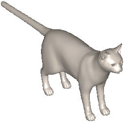
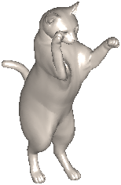
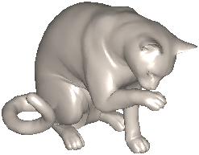
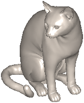
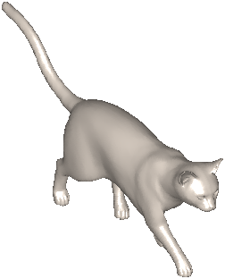
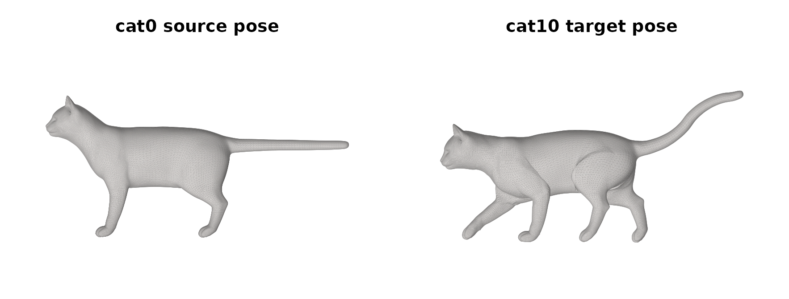
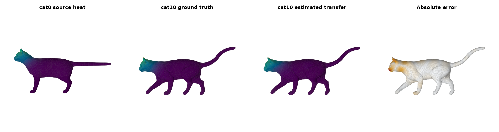
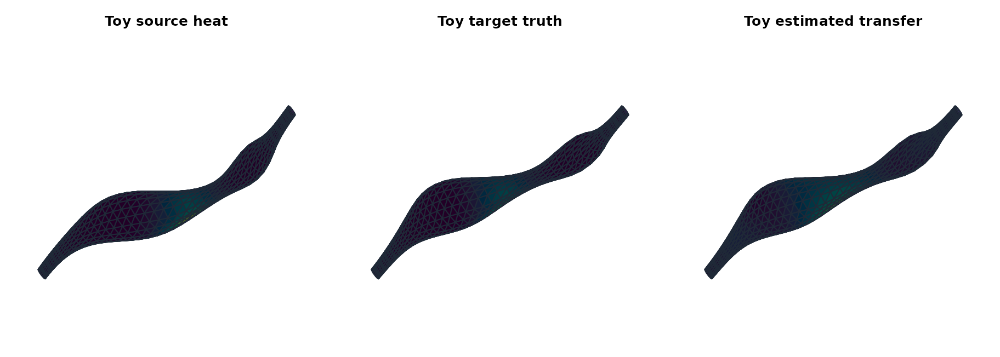

# Shape Correspondence on Posed Meshes

This vignette has two goals.

First, it shows real benchmark meshes from the classic TOSCA cats used
in early functional-maps papers. That gives the package a genuine
shape-correspondence example instead of a matrix-only toy.

Second, it keeps one small bundled mesh pair with known exact
correspondence so the package can still demonstrate a fully accurate
end-to-end workflow in a form that is cheap to render and
regression-test.

## Start with the real TOSCA cats

``` r

library(fmapsR)

pair_real <- fm_example_mesh_pair("tosca_cat10")
```

`fm_example_mesh_pair("tosca_cat10")` loads vendored meshes from the
TOSCA high-resolution cat benchmark:

- `cat0` is the source shape
- `cat10` is the target pose
- the original dataset gives a known vertex correspondence through
  shared vertex ordering
- bundled thumbnails make it easy to show the original benchmark poses
  directly in the article



The thumbnails above are the original TOSCA pose renders for `cat0`,
`cat1`, `cat2`, `cat6`, and `cat10`. They are the same family of meshes
referenced in the Ovsjanikov et al. functional-maps paper.

## Inspect the actual benchmark pair



This is the actual mesh pair used below, rendered directly from the
bundled vertices and faces rather than from the original dataset
thumbnails.

## Build a real cat-to-cat map

For the real cats, this example uses a cotangent mesh operator with
landmark-HKS descriptors and a short ICP refinement pass. The landmark
indices are known correspondences supplied to both shapes, so this is a
supervised demonstration. The transfer scores below describe this pair
and signal; they do not establish unsupervised matching accuracy or
performance across TOSCA.

``` r

op_source <- fm_operator_mesh(
  pair_real$source$vertices,
  pair_real$source$faces,
  method = "cotangent"
)
op_target <- fm_operator_mesh(
  pair_real$target$vertices,
  pair_real$target$faces,
  method = "cotangent"
)

source_real <- fm_basis(
  fm_domain_mesh(pair_real$source$vertices, pair_real$source$faces, operator = op_source),
  k = 30,
  solver = "rspectra",
  cache = FALSE
)
target_real <- fm_basis(
  fm_domain_mesh(pair_real$target$vertices, pair_real$target$faces, operator = op_target),
  k = 30,
  solver = "rspectra",
  cache = FALSE
)

desc_source_real <- fm_descriptor_hks(source_real, n_times = 6, landmarks = pair_real$landmarks)
desc_target_real <- fm_descriptor_hks(target_real, n_times = 6, landmarks = pair_real$landmarks)

fit_real <- fm_match(
  source_real,
  target_real,
  descriptors = list(source = desc_source_real, target = desc_target_real),
  penalties = list(descr = 1, lap = 1e-4, comm = 0.02),
  init = "identity",
  optimizer = "cg",
  cg_maxit = 300,
  cg_tol = 1e-8
)
stopifnot(fit_real$diagnostics$convergence == 0L)
fit_real <- fm_refine(fit_real, method = "icp", nit = 1)
```

## Compare ground-truth and estimated heat transfer



The second panel is the exact target heatmap implied by the dataset’s
known correspondence. The third panel is what `fmapsR` estimates from
the source signal alone. On this `cat0 -> cat10` pair the transferred
field stays on the correct head-and-shoulder region, tracks the body
attenuation well, and broadly preserves the target pose.

``` r

knitr::kable(real_metrics, digits = 4)
```

| metric                  |  value |
|:------------------------|-------:|
| Transfer correlation    | 0.9949 |
| Top-1% support overlap  | 0.8885 |
| Top-5% support overlap  | 0.9641 |
| Top-10% support overlap | 0.9416 |
| Transfer MSE            | 0.0007 |

This is still not a paper-perfect pointwise correspondence result. Exact
nearest-vertex recovery remains much weaker than the smooth transfer
shown above, so the right success criterion here is: does the spectral
map move a localized function to the correct target region with low
distortion? On that criterion, the current cat example is finally strong
enough to teach from.

## Keep one exact small-mesh sandbox

The bundled toy pair checks an intentionally easy case: both domains use
the same topology-derived operator and corresponding synthetic
descriptors. Its exact correspondence scores are a workflow regression
check, not evidence of accuracy on independently sampled or unfamiliar
shapes.

``` r

pair_toy <- fm_example_mesh_pair("posed_tube")
op_toy <- fm_operator_mesh(
  pair_toy$source$vertices,
  pair_toy$source$faces,
  method = "face_graph",
  weight_mode = "binary"
)

source_toy <- fm_basis(
  fm_domain_mesh(pair_toy$source$vertices, pair_toy$source$faces, operator = op_toy),
  k = 24,
  solver = "rspectra",
  cache = FALSE
)
target_toy <- fm_basis(
  fm_domain_mesh(pair_toy$target$vertices, pair_toy$target$faces, operator = op_toy),
  k = 24,
  solver = "rspectra",
  cache = FALSE
)

desc_source_toy <- cbind(
  scale(pair_toy$source$descriptors),
  fm_descriptor_hks(source_toy, n_times = 8, landmarks = pair_toy$landmarks)
)
desc_target_toy <- cbind(
  scale(pair_toy$target$descriptors),
  fm_descriptor_hks(target_toy, n_times = 8, landmarks = pair_toy$landmarks)
)

fit_toy <- fm_match(
  source_toy,
  target_toy,
  descriptors = list(source = desc_source_toy, target = desc_target_toy),
  penalties = list(descr = 1, lap = 1e-4, comm = 0.01),
  init = "identity",
  optimizer = "cg",
  cg_maxit = 8
)
fit_toy <- fm_refine(fit_toy, method = "icp", nit = 4)
```



``` r

knitr::kable(toy_table, digits = 4)
```

| metric                    |  value |
|:--------------------------|-------:|
| Exact match rate          | 1.0000 |
| Coverage ratio            | 1.0000 |
| Normalized geodesic error | 0.0000 |
| Transfer MSE              | 0.0036 |

That split is deliberate:

- the real TOSCA cats provide the recognizable benchmark visuals
- the small bundled mesh pair provides the exact quantitative workflow
  that the package can currently defend end to end
